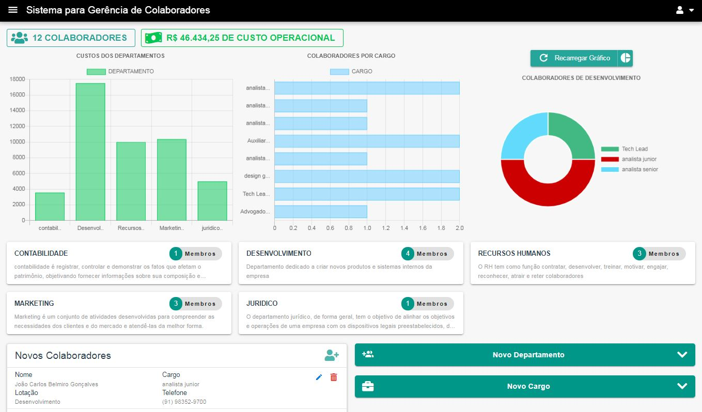

# Front-End RH
```
Este projeto tem como objetivo aplicar os principais conceitos de vuejs 2,será usada arquitetura flux,serão criados componentes básicos para serem reusados nas views,services para chamada da api,
mixins para reaproveitar código,vuex para gerênciar o estado da aplicação.
```



## Project setup
```
yarn install
```

### Compiles and hot-reloads for development
```
yarn serve
```

### Compiles and minifies for production
```
yarn build
```

### Run your unit tests
```
yarn test:unit
```

### Lints and fixes files
```
yarn lint
```

### Customize configuration
See [Configuration Reference](https://cli.vuejs.org/config/).
